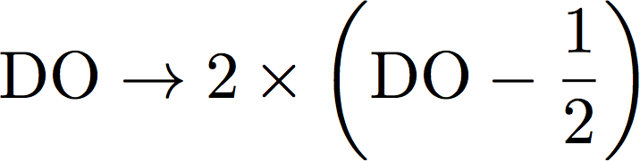
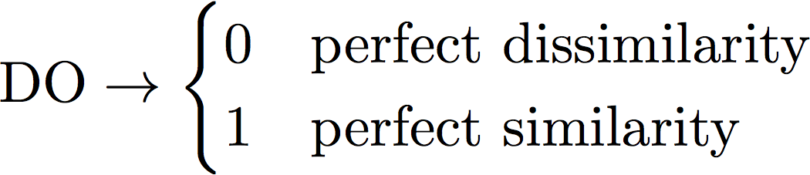

# Average Decision Ordering

## Intro

The Average Decision Ordering (ADO) metric is an alternative method of measuring the "similarity" between 2 functions which aren't necessarily 1-to-1 mappings between one another. Rather than compute the correlation between two functions (f(x) vs g(x)), ADO iteratively compares the ordering any all points in a space (i.e. x and x') after being mapped with the compared functions f(x) and g(x).

## Calculation Details

The ADO metric considers the way two separate functions, f(x) and g(x), map the same dataset. For any pair of inputs from the space, x and x', we compare the "ordering" between f(x) and f(x') with that of g(x) and g(x'). The Heavi-side step function is then used to determine whether function f and function g map those two inputs with the same relative ordering. So the ADO is can be written as

<p align="center"></p>

This can be thought of graphically by the diagram below

<p align="center"></p>

When the two mappings are perfectly similiar or perfectly dissimilar (i.e. opposit ordering), summing all ADO and normalizing to 1 yields the result 0 and 1, respectively. When the mappings are not at all related (i.e. the ordering is 50% similar and 50% dissimilar), summing over all ADO-> 0.5. We can then map this to a more convenient scale by taking

<p align="center"></p>

so, in the end,

<p align="center"></p>

## Installing the average decision ordering package

### From pip

The average decision ordering calculation is available on pypi. To install,

```python
pip install average_decision_ordering
```

the average decision ordering is designed to depend on numpy.

### Manual installation

Download the package from github

```
git clone https://github.com/taylorfaucett/average_decision_ordering.git
cd average_decision_ordering
```

and run the setup script

```python
python setup.py install
```

## Using average_decision_ordering

### General Usage

#### ADO without stats
Import the package

```python
from average_decision_ordering import ADO
```

The function requires 4 inputs:
- fx = The mapping for your first function (must be an array)
- gx = The mapping for your second function (must be an array)
- targets = target values (e.g. signal/background) (must be an array of the form [0 1 1 0 1 ...])
- n_data = The number of data_points you want to include in your calculation

```python
ADO(fx=x, gx=y, target=targets, n_data=5000)
```

the output is a single floating point value of ADO.

#### ADO with stats
By default, ADO will ADO a single calculation and output that ADO value. An optional *stats* option will perform a bootstrap (i.e. multiple randomly selected calculations of ADO) and compute the mean and standard deviation for your ADO. To output *stats* for your ADO, instead use the command

```python
ADO(fx=x, gx=y, target=targets, n_data=5000, stats=True, boot_loops=100)
```

Where *boot_loops* allows you to specify how many times you want to loop through your data (i.e. how many calculations of ADO you want to include in your mean and standard deviation). Including stats gives 2 floating point numbers as the output (i.e. mean, st_dev).

## Test Example

A simple test file is provided *test.py*. Using random numbers for fx, gx and the target values means we expect the ADO to be approximately zero.

```python
import numpy as np
from average_decision_ordering import ADO

n_data = 5000
n_calc = 500
x = np.random.rand(n_data)
y = np.random.rand(n_data)
targets = np.random.randint(2, size=n_data)

# ADO calculated without statistics
print(ADO(fx=x, gx=y, target=targets, n_data=n_calc))

# ADO calculated with statistics (i.e. mean and stdev of ADO)
print(ADO(fx=x, gx=y, target=targets, n_data=n_calc, stats=True))

# ADO example where you expect perfect similarity (i.e. compare x with x)
print(ADO(fx=x, gx=x, target=targets, n_data=n_calc))
print(ADO(fx=x, gx=x, target=targets, n_data=n_calc, stats=True))
```

which yields the expected result (note your results will differ as every time this test file is run, it generates a new set of random values)
```python
0.0009599999999998499
(0.030339066141999212, 0.024181331076012114)

1.0
(1.0, 8.881784197001253e-17)
```


