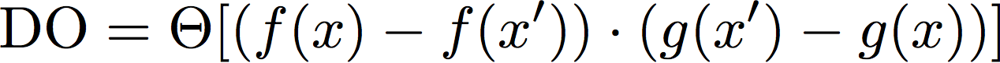
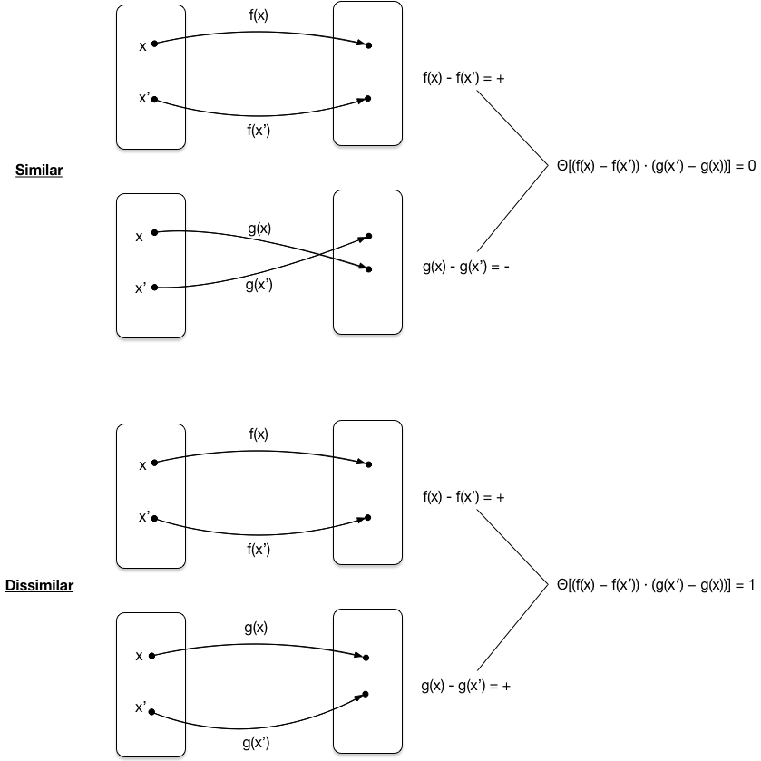

# Average Decision Ordering

## Intro

The Average Decision Ordering (ADO) metric is an alternative method of measuring the "similarity" between 2 functions which aren't necessarily 1-to-1 mappings between one another. Rather than compute the correlation between two functions (f(x) vs g(x)), ADO iteratively compares the ordering any all points in a space (i.e. x and x') after being mapped with the compared functions f(x) and g(x).

## Calculation Details

The ADO metric considers the way two separate functions, f(x) and g(x), map the same dataset. For any pair of inputs from the space, x and x', we compare the "ordering" between f(x) and f(x') with that of g(x) and g(x'). The Heavi-side step function is then used to determine whether function f and function g map those two inputs with the same relative ordering. So the ADO is can be written as

<p align="center"></p>

This can be thought of graphically by the diagram below

<p align="center"></p>

When the two mappings are perfectly similiar or perfectly dissimilar (i.e. opposit ordering), summing all ADO and normalizing to 1 yields the result 0 and 1, respectively. When the mappings are not at all related (i.e. the ordering is 50% similar and 50% dissimilar), summing over all ADO-> 0.5. 

## Installing the average decision ordering package

### From pip

The average decision ordering calculation is available on pypi. To install,

```python
pip install average_decision_ordering
```

### Requirements
The ADO calculation only requires numpy and pandas

### Manual installation
Download the package from github

```
git clone https://github.com/taylorfaucett/average-decision-ordering.git
cd average-decision-ordering
```

and run the setup script

```python
python setup.py install
```

## Using average_decision_ordering

### General Usage

#### ADO Example
Import the package

```python
from average_decision_ordering import calc_ado
```

The function requires 4 inputs:
- fx = The mapping for your first function (must be an array)
- gx = The mapping for your second function (must be an array)
- targets = target values (e.g. signal/background) (must be an array of the form [0 1 1 0 1 ...])
- n_pairs = The number of signal/background pairs to generate/check (note this value must be less than the product of the two inputs lengths.)

```python
ADO(fx=x, gx=y, target=targets, n_pairs=100000)
```

the output is a single floating point value of ADO.

## Test Example

A simple test file is provided *example.py*. Using random numbers for fx, gx and the target values means we expect the ADO to be approximately zero.

```python
import numpy as np
from average_decision_ordering import calc_ado

data_size = 50000
n_pairs = 100000
x = np.random.rand(data_size)
y = np.random.rand(data_size)
targets = np.random.randint(2, size=data_size)

# ADO calculated without statistics
print(calc_ado(fx=x, gx=y, target=targets, n_pairs=N_pairs))

# ADO example where you expect perfect similarity (i.e. compare x with x)
print(calc_ado(fx=x, gx=x, target=targets, n_pairs=N_pairs))

```
